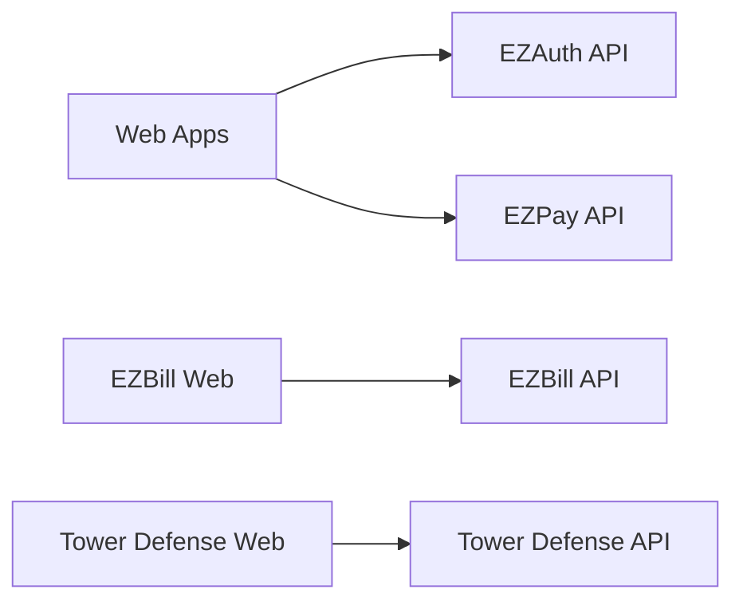

# 🏗️ Architecture Audit - @ezstart Monorepo

**Last Updated:** [DATE]
**Status:** 🔴 Not Audited

---

## 📋 Overview

Architecture audit covering dependency graph, package structure, code organization, and monorepo best practices.

---

## 📦 Package Structure

### Compliance with CLAUDE.md

```bash
# Check package structure
find packages -type d -maxdepth 1
find apps -type d -maxdepth 2
```

### Package Hierarchy

| Package | Type | Location | Compliance | Status |
|---------|------|----------|------------|--------|
| @ezstart/ui | Shared | packages/ | ✅ | 🟢 |
| @ezstart/types | Shared | packages/ | ✅ | 🟢 |
| @ezstart/auth-sdk | Shared | packages/ | ✅ | 🟢 |
| @ezstart/pay-sdk | Shared | packages/ | ✅ | 🟢 |
| @ezstart/express-core | Shared | packages/ | ✅ | 🟢 |
| @tower-defense/types | Project-specific | apps/tower-defense/ | ✅ | 🟢 |
| @tower-defense/config | Project-specific | apps/tower-defense/ | ✅ | 🟢 |

**Findings:**
- ❌ [Package in wrong location]
- ✅ [Proper structure]

---

## 🔗 Dependency Graph

### Workspace Dependencies

```bash
# Generate dependency graph
pnpm list --depth=1 --json > dependency-graph.json

# Check circular dependencies
pnpm turbo run build --dry-run --graph
```

### Critical Dependencies

```mermaid
graph TD
    A[Apps] --> B[Shared Packages]
    B --> C[Config Packages]

    A1[web-ezstart] --> P1[@ezstart/ui]
    A1 --> P2[@ezstart/auth-sdk]
    A2[api-ezauth] --> P3[@ezstart/express-core]
```

**Findings:**
- ❌ [Circular dependency detected]
- ✅ [Clean dependency tree]

---

## 🔄 Circular Dependencies

### Check for Cycles

```bash
# Using madge
npx madge --circular --extensions ts,tsx packages/
npx madge --circular --extensions ts,tsx apps/
```

### Results

| Package A | Package B | Issue | Status |
|-----------|-----------|-------|--------|
| - | - | - | 🟢 |

**Findings:**
- ❌ [Circular dependency found]
- ✅ [No circular dependencies]

---

## 📁 Code Organization

### Shared Code Utilization

**Principle:** Maximum reusability, minimum duplication

- [ ] UI components centralized in `@ezstart/ui`
- [ ] Types centralized in `packages/types` or `apps/[project]/types`
- [ ] Utils centralized in `packages/utils` or `apps/[project]/utils`
- [ ] Configs centralized in config packages
- [ ] No duplication of business logic

**Check:**
```bash
# Find potential duplicates
find apps/ packages/ -name "*.ts" -o -name "*.tsx" | xargs grep -l "export const Button"
```

**Findings:**
- ❌ [Duplicated component found]
- ✅ [Proper code sharing]

---

## 🎯 Single Source of Truth

### Configuration Files

| Config Type | Location | Apps Using | Status |
|-------------|----------|------------|--------|
| Tailwind | `@ezstart/tailwind-config` | 8/8 | ✅ |
| ESLint | `@ezstart/eslint-config` | 100% | ✅ |
| TypeScript | `@ezstart/typescript-config` | 100% | ✅ |
| Next.js | `@ezstart/next-config` | 8/8 | ✅ |
| PostCSS | `@ezstart/ui` | 8/8 | ✅ |

**Findings:**
- ❌ [Config not centralized]
- ✅ [100% centralization]

---

## 🌐 API Architecture

### API Standards Compliance

```bash
# Check API structure
for api in apps/*/api; do
  echo "=== $api ==="
  ls $api/src/
done
```

### Results

| API | express-core | /api prefix | index.ts | Health Check | Status |
|-----|--------------|-------------|----------|--------------|--------|
| EZAuth | ✅ | ✅ | ✅ | ✅ | 🟢 |
| EZBill | ✅ | ✅ | ✅ | ✅ | 🟢 |
| EZPay | ✅ | ✅ | ✅ | ✅ | 🟢 |
| Tower Defense | ✅ | ✅ | ✅ | ✅ | 🟢 |
| GreenPulse | ? | ? | ? | ? | 🔴 |

**Findings:**
- ❌ [API not following standards]
- ✅ [Compliant API]

---

## 🎨 Frontend Architecture

### Component Standards

- [ ] All apps use `@ezstart/ui` components
- [ ] No native HTML elements (`<div>`, `<button>`)
- [ ] Semantic color classes (no hardcoded colors)
- [ ] Consistent provider setup (Theme + Auth)
- [ ] Next.js app router structure

**Check:**
```bash
# Find native HTML usage
grep -r "<button\|<div\|<input" apps/*/web/src/components/ | wc -l
```

**Findings:**
- ❌ [Native HTML elements used]
- ✅ [Proper component usage]

---

## 🔌 Integration Architecture

### Service Communication



**Findings:**
- ❌ [Incorrect service communication]
- ✅ [Proper architecture]

---

## 📊 Package Metrics

### Package Sizes

```bash
# Calculate package sizes
du -sh packages/*
du -sh apps/*/web
du -sh apps/*/api
```

### Results

| Package | Size | Type | Status |
|---------|------|------|--------|
| @ezstart/ui | ? MB | Shared | 🔴 |
| @ezstart/auth-sdk | ? MB | Shared | 🔴 |
| @ezstart/pay-sdk | ? MB | Shared | 🔴 |

**Findings:**
- ❌ [Package too large]
- ✅ [Reasonable size]

---

## 🛠️ Build Architecture

### TypeScript Project References

```bash
# Check composite configuration
grep -r "composite" */tsconfig.json apps/*/tsconfig.json packages/*/tsconfig.json
```

- [ ] Root `tsconfig.json` has project references
- [ ] All packages have `composite: true`
- [ ] Single `tsc -b --watch` at root
- [ ] No individual `tsc --watch` in packages

**Findings:**
- ❌ [Missing composite configuration]
- ✅ [Proper TypeScript setup]

---

## 📚 Documentation Architecture

### README Coverage

```bash
# Check README presence
find packages -name "README.md" -type f
```

| Package | README | Up-to-date | Examples | API Docs | Status |
|---------|--------|------------|----------|----------|--------|
| @ezstart/ui | ? | ? | ? | ? | 🔴 |
| @ezstart/auth-sdk | ? | ? | ? | ? | 🔴 |
| @ezstart/pay-sdk | ? | ? | ? | ? | 🔴 |

**Findings:**
- ❌ [Missing or outdated README]
- ✅ [Well documented]

---

## 🎯 Monorepo Best Practices

### Compliance Checklist

- [ ] Workspace protocol used (`workspace:*`)
- [ ] No version mismatches
- [ ] Turbo pipeline configured
- [ ] Shared configs utilized
- [ ] No symlink issues
- [ ] Proper `.gitignore` setup

**Findings:**
- ❌ [Best practice violation]
- ✅ [Following best practices]

---

## 📊 Summary

### Architecture Score: 🔴 0/100

**Critical Issues:** 0
**High Priority:** 0
**Medium Priority:** 0
**Low Priority:** 0

**Architectural Debt:**
1. [Debt item 1]
2. [Debt item 2]
3. [Debt item 3]

**Refactoring Priorities:**
1. [Priority 1]
2. [Priority 2]
3. [Priority 3]

---

## 🔄 Next Audit

**Scheduled:** [DATE]
**Assigned:** [PERSON]

---

## 📚 References

- [CLAUDE.md](../../CLAUDE.md) - Monorepo architecture rules
- [Turborepo Best Practices](https://turbo.build/repo/docs/handbook)
- [PNPM Workspace](https://pnpm.io/workspaces)
- [TypeScript Project References](https://www.typescriptlang.org/docs/handbook/project-references.html)